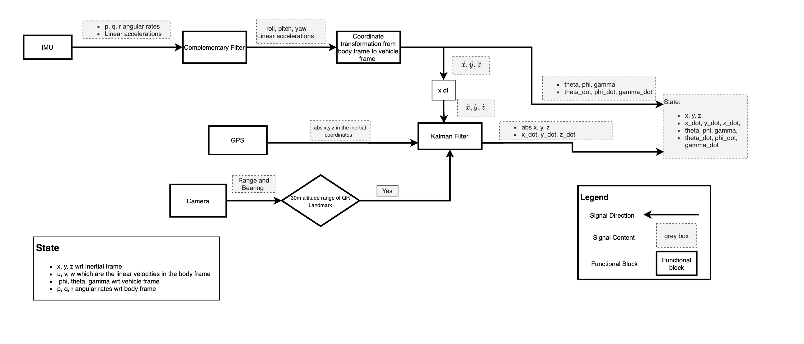
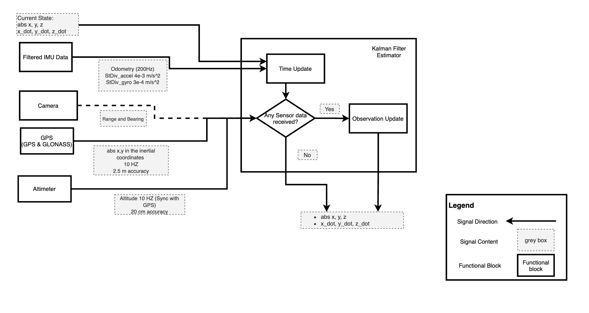
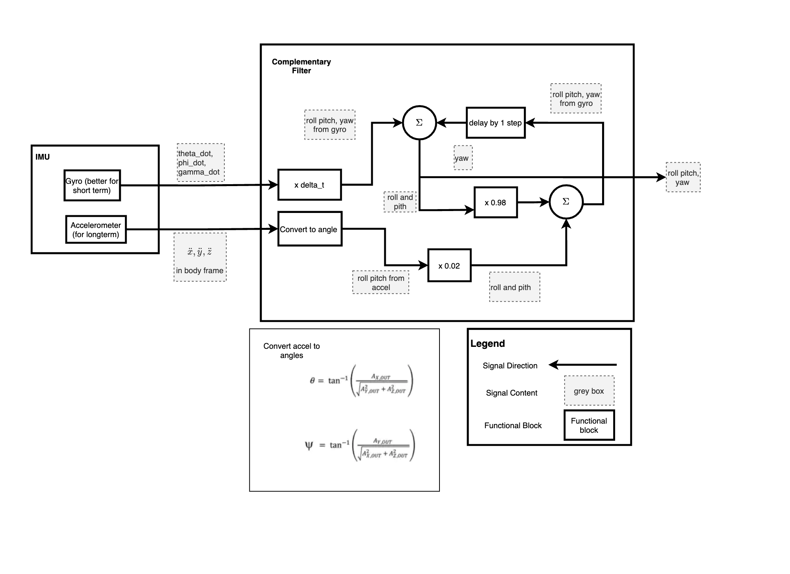
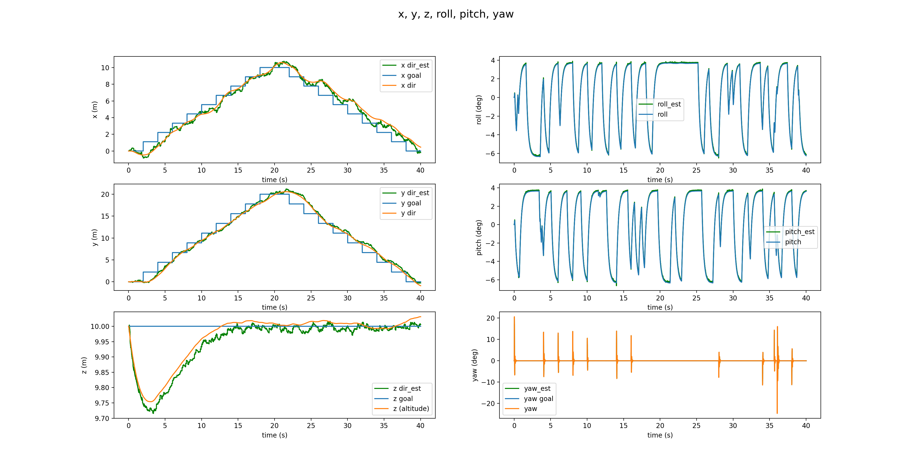
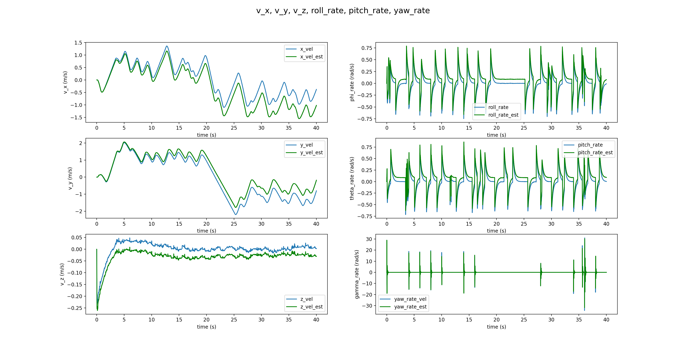
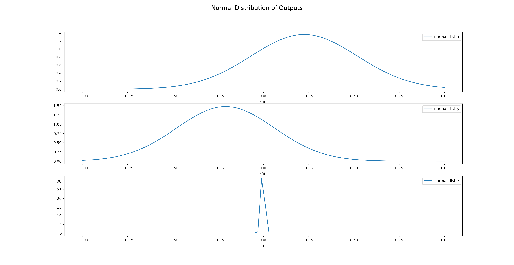

# Hexacpter_controller_estimator

Followings are the result of the Dynamics model, controller, and estimator design for a Hexacopter system which will be used for a drone delivery system.

Refrences:\
Quadrotor Dynamics and Control Rev 0.1  by Randal Beard
https://andrew.gibiansky.com/blog/physics/quadcopter-dynamics/
https://www.electricrcaircraftguy.com/2013/09/propeller-static-dynamic-thrust-equation.html
https://www.ijais.org/research/volume9/number5/moussid-2015-ijais-451411.pdf
https://github.com/abhijitmajumdar/Quadcopter_simulator
https://www.youtube.com/watch?v=whSw42XddsU

